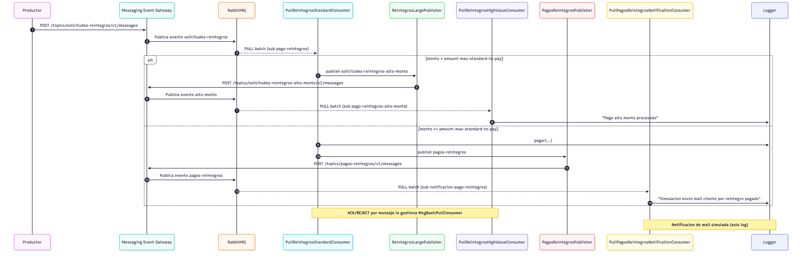
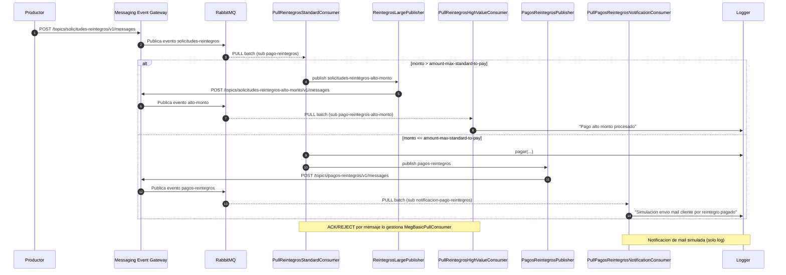

# Sample Consumer

App **PoC** para probar integración **PUSH** (webhook HTTP) y **PULL** (consumo programado con `@MegPullSubscription`) contra un **Messaging Event Gateway**.

Documentación del proyecto: **[`SPEC.md`](SPEC.md)**. Allí está fijado el patrón de **Reactor + programación funcional** para todo el módulo `app` (cambios futuros deben respetarlo).

## Requisitos

- JDK 17
- Una instancia del gateway accesible por HTTP (típicamente `http://localhost:8080`).
- Dependencia **`com.smg:pull-consumer-lib`** resolvida según tu forma de build (en este árbol ver [**workspace `SPEC.md` en la raíz**](../SPEC.md)).

## Topicos y suscripciones (curl contra el gateway)

Levantá antes el **gateway** (y Mongo/Rabbit que use). `nameSub` debe ser **único por topic**: un sub para **PULL** y otro para **PUSH** (no pueden llamarse igual).

### 1) Topic `solicitudes-reintegros` versión 1

```bash
curl --location 'http://localhost:8080/topics' \
  --header 'Content-Type: application/json' \
  --data '{
    "id": "solicitudes-reintegros",
    "version": 1,
    "description": "Topic principal para publicar pedidos de reintegros",
    "ownerApp": "finanzas-api"
  }'
```

### 1.1) Topic `pagos-reintegros` versión 1

```bash
curl --location 'http://localhost:8080/topics' \
  --header 'Content-Type: application/json' \
  --data '{
    "id": "pagos-reintegros",
    "version": 1,
    "description": "Topic para publicar eventos de reintegros pagados",
    "ownerApp": "finanzas-api"
  }'
```

### 2) Suscripción **PULL** (`nameSub`: `pago-reintegros`)

Guardá de la respuesta el `id` (ej. `solicitudes-reintegros-v1-pago-reintegros`) y el **`token`** para `application.yml` / `SAMPLE_SUB_TOKEN`.

```bash
curl --location 'http://localhost:8080/subscriptions' \
  --header 'Content-Type: application/json' \
  --data '{
    "topicId": "solicitudes-reintegros",
    "topicVersion": 1,
    "nameSub": "pago-reintegros",
    "description": "procesador de reintegros por PULL",
    "type": "PULL",
    "urlRest": null,
    "maxRetries": 10
  }'
```

### 3) Suscripción **PUSH** (`nameSub`: `pago-reintegros-push`)

**`urlRest`:** el gateway hace el POST **desde donde corre el proceso**. Si el gateway está en **Docker** y el sample en tu máquina, `localhost:8181` **no** alcanza al contenedor: usá el host así:

```text
http://host.docker.internal:8181/ws.reintegros/pagos
```

Si el **gateway y el sample** corren **en el host** (por ejemplo gateway con `mvn spring-boot:run` y sample igual, sin contenedor del gateway), entonces:

```text
http://localhost:8181/ws.reintegros/pagos
```

```bash
curl --location 'http://localhost:8080/subscriptions' \
  --header 'Content-Type: application/json' \
  --data '{
    "topicId": "solicitudes-reintegros",
    "topicVersion": 1,
    "nameSub": "pago-reintegros-push",
    "description": "procesador de reintegros por PUSH",
    "type": "PUSH",
    "urlRest": "http://host.docker.internal:8181/ws.reintegros/pagos",
    "maxRetries": 10
  }'
```

En Linux puro sin `host.docker.internal`, configurá la red Docker o el compose del gateway (ej. `extra_hosts`) y usá la IP/host que alcance tu Mac/servidor desde el contenedor.

### 3.1) Suscripción **PULL** para notificación de pago por mail (`nameSub`: `notificacion-pago-reintegros`)

Esta suscripción consume el topic `pagos-reintegros` en el sample con `PullPagosReintegrosNotificationConsumer`, que **simula** envío de mail con logs.

```bash
curl --location 'http://localhost:8080/subscriptions' \
  --header 'Content-Type: application/json' \
  --data '{
    "topicId": "pagos-reintegros",
    "topicVersion": 1,
    "nameSub": "notificacion-pago-reintegros",
    "description": "notificacion por mail de reintegros pagados (simulada)",
    "type": "PULL",
    "urlRest": null,
    "maxRetries": 10
  }'
```

Guardá de la respuesta el `token` y configuralo en `sample.topics.in.pagos-reintegros.subscription.token` (o variable de entorno equivalente).

### 4) Publicar un mensaje (`solicitudes-reintegros` v1)

El gateway enruta el evento a las colas de RabbitMQ de **todas** las suscripciones de ese topic/version (en este ejemplo, PULL `pago-reintegros` y PUSH `pago-reintegros-push`).

```bash
curl --location 'http://localhost:8080/topics/solicitudes-reintegros/v1/messages' \
  --header 'Idempotency-Key: evt-001' \
  --header 'X-Topic-Token: TOPIC_TOKEN_DEVUELTO_EN_CREATE_TOPIC' \
  --header 'X-Correlation-Id: corr-001' \
  --header 'X-Source-App: finanzas-api' \
  --header 'Content-Type: application/json' \
  --data '{
    "user": "jdoe",
    "eventType": "reintegro.solicitado",
    "payload": {
      "monto": 1000,
      "cbu": "0110567620056701234560",
      "du": "29345928"
    }
  }'
```

Instalá antes la librería (`cd ../pull-consumer-lib && mvn install -DskipTests`). Levantá el sample en **8181** (`mvn spring-boot:run`) con el **token** PULL configurado; **PUSH** hará POST al `urlRest` que definiste y **PULL** consumirá por la librería según [`app/README.md`](app/README.md). Política HTTP del gateway sobre el webhook (4xx vs 5xx y DLQ): [Messaging Event Gateway · SPEC §3.4](../messaging-event-gateway/SPEC.md#34-envio-push-webhook).

## Diagrama de secuencia (PoC)



Fuente editable (Mermaid):



## Estructura

| Carpeta | Rol |
|---------|-----|
| [`app/`](app/) | Spring Boot, puerto **8181**. Detalle en [`app/README.md`](app/README.md). |

## Ejecutar

```bash
mvn spring-boot:run
```

Opcional:

```bash
export SAMPLE_SUB_TOKEN="TOKEN_DE_LA_SUB"
mvn spring-boot:run
```

El **token** es el que devolvió la suscripción **PULL** en el paso 2.

## Referencia de API del servidor

Los contratos HTTP del gateway están en **[Messaging Event Gateway · SPEC](../messaging-event-gateway/SPEC.md)**.
